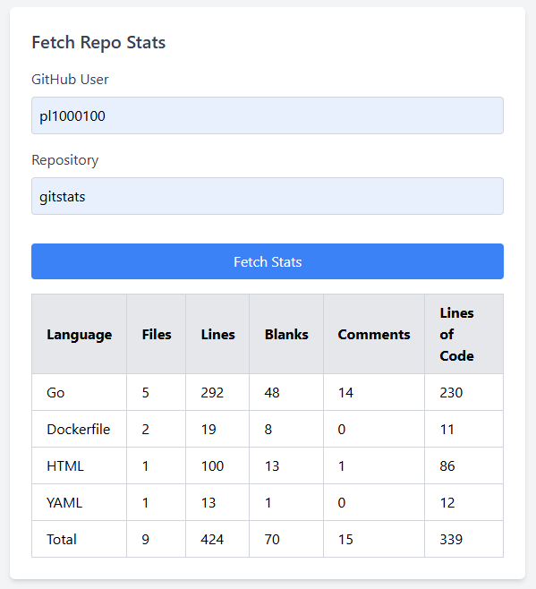
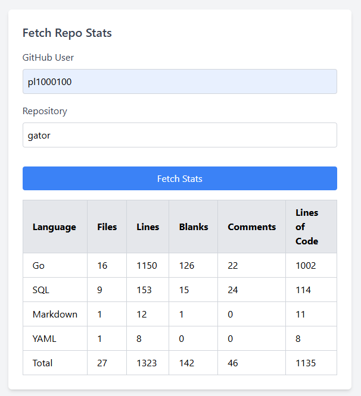
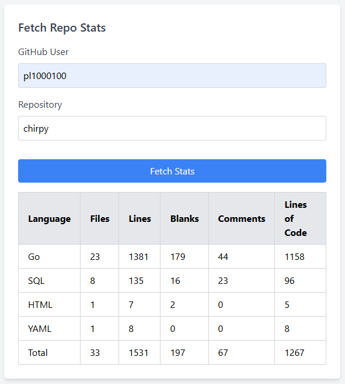

# Gitstats
## Gives statistics for github repos



## Available also through API calls 
* GET /api/v1/repositories/{user} - calls github to get list of available repos of user
* GET /api/v1/stats/{user}/{repo} - calls codetabs to get stats for repo
* GET /api/v1/stats/{user} - calls codetabs to get stats for repos of given user, codetabs ratelimit to 1 API call per 5s, limited to 30 repos, have long waiting time

## Install
.env in backend needs **GITHUB_ACCESS_TOKEN**=

use ```docker compose up --build```
